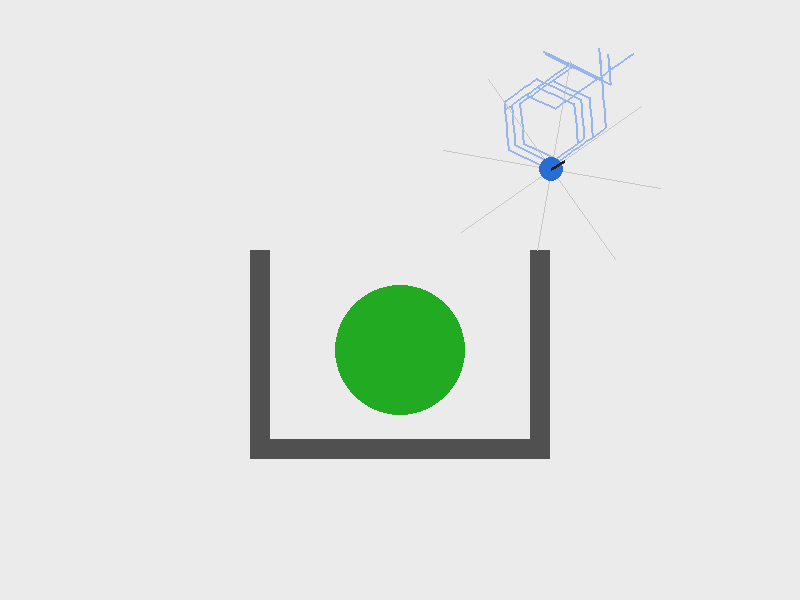
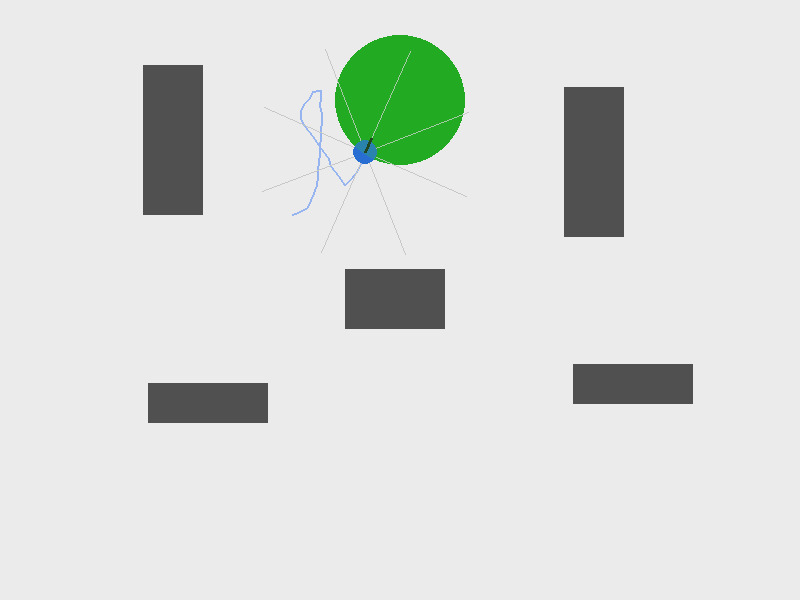

# Testing Guide — Training Wheels (Level 0)

This file explains how to try out everything delivered so far, in order of
increasing effort: from "just read/validate a file" up to "watch the robot
move on screen". You do not need a GUI for most of it.

**In a hurry?** Run `python3 verify_install.py` first — one command,
prints a pass/fail table covering every module. Come back to this file's
numbered sections only for whatever specifically failed, or when you want
the full story (screenshots, measured numbers, bugs that were caught and
fixed) behind a module rather than just a yes/no.

This guide itself will grow alongside the code — each new module (grid
world, search policies, CSP, utility-based, minimax, Q-learning) gets its
own section here when it's delivered.

## Table of contents

- [0. Prerequisites](#0-prerequisites)
- [1. Zero-setup checks](#1-zero-setup-checks-no-environment-no-window-seconds-to-run)
- [2. Import checks](#2-import-checks-confirms-the-project-files-are-wired-correctly)
- [3. Headless environment smoke test](#3-headless-environment-smoke-test-no-window-checks-the-physicslogic)
- [4. Running the reflex agents](#4-running-the-reflex-agents-headless-the-way-youll-actually-grade)
- [5. Visual confirmation](#5-visual-confirmation-this-is-the-part-thats-actually-fun) — reflex agents, screenshots, GIFs
- [6. Connecting to Activity 1](#6-connecting-this-to-activity-1-the-word-document)
- [7. Goal-based search](#7-testing-grid_worldpy-and-search_policiespy-goal-based-search) — `grid_world.py`, `search_policies.py`
- [8. `visualize_search.py`](#8-visualize_searchpy--one-static-image-grid--highlighted-path) — static plan image
- [9. `visualize_utility.py`](#9-visualize_utilitypy--utility-based-vs-plain-shortest-path) — utility-based
- [10. `worlds/csp_dense.json`](#10-worldscsp_densejson--the-dense-map-for-the-csp-module)
- [11. `csp_spawn.py`](#11-csp_spawnpy--backtracking-vs-generate-and-test) — CSP: backtracking vs. generate-and-test
- [12. `minimax_search.py` / `visualize_minimax.py`](#12-minimax_searchpy--visualize_minimaxpy--predator-prey) — minimax, alpha-beta, predator-prey
- [13. `qlearning.py`](#13-qlearningpy--visualize_qlearningpy--learning-agent) — Q-learning, Phase 1 and 2
- [14. `ga_learning.py`](#14-ga_learningpy--visualize_gapy--demo_ga_livepy--the-ga-agent) — GA, Phase 1 and 2
- [Troubleshooting](#troubleshooting)

---

## 0. Prerequisites

You need the original project files (`foraging_env.py`, `controllers.py`,
`config_loader.py`, and a `worlds/` folder containing `random_obstacles.json`,
`u_shape.json`, `n_shape.json`) with `training_wheels/` dropped in anywhere
inside that same repo — as a sibling of `foraging_env.py`, one level
deeper, wherever's convenient. No manual flattening is required: `edu_env.py`
and the `agents/` modules that need the simulator locate it automatically
by walking up from their own file location. See `README.md`'s Installation
section for details (and for the story of why this file used to say
otherwise).

Python packages required (already needed by the original project, nothing
new introduced by `training_wheels/`):

```
pip install gymnasium numpy pygame numba
```

You do **not** need `pybullet`, `imageio`, or `pytest` for anything in
Level 0 — those belong to the 3D level (`essim3d.py`) or to video export,
neither of which this package touches.

The commands below assume `training_wheels/` was dropped as-is inside your
simulator repo (not flattened) and that you're running them from the
simulator's root directory — but they work the same from inside
`training_wheels/` too, per the note above.

---

## 1. Zero-setup checks (no environment, no window, seconds to run)

These don't even import `foraging_env`, so they will work even before you've
placed the project files correctly. Good first step to confirm your Python
environment itself is sane.

### 1.1 Validate the PEAS json

```bash
python3 -c "import json; json.load(open('training_wheels/peas_foraging.json')); print('OK')"
```

Expected: `OK`. If this fails, the json has a syntax error — fix it before
anything else, since later exercises reference this file directly.

### 1.2 Run the table-driven combinatorics demo

```bash
python3 training_wheels/agents/table_driven_agent.py
```

Expected: a short printed table (3 / 5 / 10 bins per sensor) plus a closing
paragraph. This script has **no dependency on the simulator at all** — if
it doesn't run, the problem is your Python installation, not the project.
This is also the script students will call from Activity 1 (with different
`bins_per_sensor` values than the ones hardcoded in `__main__`).

---

## 2. Import checks (confirms the project files are wired correctly)

Run this from your simulator's root directory (adjust the leading
`training_wheels.` path if you dropped the folder somewhere other than
directly at the root):

```bash
python3 -c "
from training_wheels.edu_env import make_edu_env
from training_wheels.agents.simple_reflex_agent import SimpleReflexAgent
from training_wheels.agents.model_based_reflex_agent import ModelBasedReflexAgent
print('All imports OK')
"
```

(You can also `cd training_wheels` first and drop the `training_wheels.`
prefix — both work, since the underlying bootstrap in `edu_env.py` and the
`agents/` modules finds `foraging_env.py` either way.)

If this fails with `ModuleNotFoundError: No module named 'foraging_env'`,
something is genuinely off with your folder layout — `training_wheels/`
needs to live *somewhere* inside (or next to) the folder that contains
`foraging_env.py`, just not arbitrarily far from it. The error message
itself will tell you which file's bootstrap failed and from where it
searched.

If it fails with `ModuleNotFoundError: No module named 'pygame'` (or
`numba`, `gymnasium`), install the missing package (see Section 0).

---

## 3. Headless environment smoke test (no window, checks the physics/logic)

This confirms `edu_env.py` actually builds a working environment and an
episode can run start to finish, without opening any graphical window.

```bash
python3 -c "
from edu_env import make_edu_env

env = make_edu_env(map_name='default', num_agents=1)
obs_list, info = env.reset()
print('Observation shape:', obs_list[0].shape)

for _ in range(50):
    obs_list, _, terminated, truncated, info = env.step([0])  # always 'forward'
    if terminated or truncated:
        break

print('Ran', info['step_count'], 'steps. Success:', info['success'])
env.close()
"
```

Expected: an observation shape of `(10,)` (8 proximity sensors + food
bearing + odor — no social signal at this course level, see
`peas_foraging.json`'s `"sensors"` field), and a step count printed without
any exception.

This is also the fastest way to verify a **"wired": true** claim from the
PEAS json yourself: change `num_agents=1` to `num_agents=2` and check that
`obs_list` now has two entries with 11 values each (the social channel
reappears in the observation vector once `num_agents > 1`, per
`ForagingEnv._get_obs_single`) — that confirms the `"agents"` field really
is wired, exactly as documented.

---

## 4. Running the reflex agents (headless, the way you'll actually grade)

```bash
python3 demo_level0_reflex.py --agent simple --episodes 5
python3 demo_level0_reflex.py --agent model_based --episodes 5
```

Expected: 5 lines like `Episode N: SUCCESS in NNN steps` or `Episode N: FAIL
in 1000 steps` (1000 is `max_steps`, hardcoded in `essim2d.py`'s config
pattern and mirrored in `edu_env.py`).

**What to actually look for, not just "did it crash":**

- On `--map default`, both agents should reach a reasonably high success
  rate — it's an open-ish map, so the difference between reflex types is
  not very visible here.
- On `--map u_shape`, run both agents several times each:

  ```bash
  python3 demo_level0_reflex.py --agent simple --map u_shape --episodes 10
  python3 demo_level0_reflex.py --agent model_based --map u_shape --episodes 10
  ```

  This is the map designed to expose the difference: `SimpleReflexAgent`
  has no persistent belief about "which way I was already turning", so it
  is more prone to oscillating at the mouth of the U. `ModelBasedReflexAgent`
  should look visibly more consistent here. If the two look identical on
  this map, something is off (see Troubleshooting).

---

## 5. Visual confirmation (this is the part that's actually fun)

Everything above only prints numbers. Sometimes you want to *see* the robot
move — both to sanity-check your own understanding of an agent's behavior,
and because watching a simple reflex agent get visibly confused in a corner
is a much better classroom moment than reading "FAIL in 600 steps".

### 5.1 On your own machine (has a display)

```bash
python3 demo_level0_reflex.py --agent model_based --map u_shape --render --episodes 1
```

This opens a live `pygame` window.

### 5.2 On a headless server (SSH, no physical display)

Either install a virtual display and keep using `--render` normally:

```bash
sudo apt-get install xvfb
xvfb-run -a python3 demo_level0_reflex.py --agent model_based --map u_shape --render
```

...or render to an in-memory surface and save still frames as PNGs instead
of opening a window at all — this is exactly how the two screenshots below
were produced, with no display attached:

```bash
export SDL_VIDEODRIVER=dummy
python3 -c "
import pygame
from edu_env import make_edu_env
from agents.simple_reflex_agent import SimpleReflexAgent

env = make_edu_env(map_name='default', num_agents=1)
agent = SimpleReflexAgent(model_path='braitenberg_avoidance.json')
obs_list, info = env.reset()
agent.reset()

done = False
while not done:
    action = agent.act(obs_list[0], info)
    obs_list, _, terminated, truncated, info = env.step([action])
    env.render()
    done = terminated or truncated

pygame.image.save(env.window, 'snapshot.png')
print('success:', info['success'], 'steps:', info['step_count'])
env.close()
"
```

(You may see harmless `ALSA lib ... Unknown PCM default` warnings on a
headless machine — that's `pygame`'s audio subsystem complaining there's no
sound card, and has nothing to do with rendering. Safe to ignore.)

### 5.3 What you should actually see

These two screenshots were captured while writing this guide, using the
exact script above (not staged or cherry-picked for good looks — the first
one is an honest failure, included on purpose):

**`ModelBasedReflexAgent` on `u_shape`, mid-episode, still searching:**



The pale trail is the path traveled so far — note the loops above the
U-mouth. This particular run did not reach the food within 400 steps. That
is a legitimate, useful thing to show a class: a model-based reflex agent
with a fixed wall-following bias can still fail to enter a U-shaped trap
depending on which side it approaches from. Worth discussing *why* before
moving on to the goal-based module, which fixes this with an actual plan.

**`SimpleReflexAgent` on `default`, successful episode:**



The blue circle is the robot, the thin lines are its 8 proximity sensor
rays, the green circle is the food, and the light trail shows the whole
path taken. This run succeeded in 92 steps — but notice it took 8 failed
episodes before this one in the batch that produced it (`FAIL in 600 steps`
eight times in a row first, because `edu_env.py` was missing an explicit
`max_steps=1000` at the time — since fixed, see the note below). That
variance is real and worth mentioning to students: `--episodes 1` is not a
fair test of whether an agent "works" — run at least 10 before drawing
conclusions.

**A bug this testing pass actually caught:** `edu_env.py` originally left
`max_steps` at `ForagingEnvConfig`'s default of 600 instead of the 1000
used by `essim2d.py`. It was caught only by actually running the code
end-to-end, not by reading it — a good reminder for the "wired: true/false"
exercise in Activity 1's spirit: the only way to really know what a config
default does is to run it and check, not to assume from the field name.

**A second, more visible bug caught the same way:** `demo_level0_reflex.py`
originally never called `env.render()` inside the episode loop — it only
passed `render_mode="human"` when constructing the environment. Since
`ForagingEnv` only creates and updates its window when `render()` is
explicitly called each step, the script ran to completion with no error
and no window at all: `--render` looked like it did nothing. Reading the
script would not have caught this (it looks reasonable at a glance);
running it with `--render` on an actual display did. Fixed by calling
`env.render()` (plus a small `time.sleep(args.sleep)` for pacing) inside
the loop whenever `--render` is passed.

**A design flaw found by actually comparing the two agents on the same
map (not a code bug, but worth documenting the same way):**
`ModelBasedReflexAgent` originally performed *worse* than the simpler
`SimpleReflexAgent` on `u_shape` (0/5 vs 2/5 successes) — an early sign
that a "more sophisticated" architecture doesn't automatically mean better
behavior. The cause: `HeuristicCalibrationController` (the wrapped
controller) was built for the two-robot social scenario, where a social
signal decides which wall to follow; with no social channel, it silently
defaulted to always following the same fixed side, on every map, forever.
Fixed in `ModelBasedReflexAgent.act()` by synthesizing that missing input
from the food bearing already in the percept, instead of leaving it
starved — see the full story in `agents/model_based_reflex_agent.py`'s
module docstring. After the fix, both maps improved dramatically:

| Map | Before fix | After fix |
|---|---|---|
| `u_shape` (10 episodes) | 0/10 | 10/10 |
| `default` (10 episodes) | ~4/10 | 7/10 |

### 5.4 Seeing the fix live, not just trusting the numbers

Run this to watch which side gets chosen change from episode to episode,
tied directly to the food's bearing at the start of each one:

```bash
python3 -c "
from edu_env import make_edu_env
from agents.model_based_reflex_agent import ModelBasedReflexAgent

env = make_edu_env(map_name='u_shape', num_agents=1)
agent = ModelBasedReflexAgent(agent_idx=0)

for ep in range(5):
    obs_list, info = env.reset()
    agent.reset()
    food_bearing = obs_list[0][8]
    side = 'RIGHT' if food_bearing > 0 else 'LEFT'
    done = False
    while not done:
        action = agent.act(obs_list[0], info)
        obs_list, _, terminated, truncated, info = env.step([action])
        done = terminated or truncated
    print(f'Episode {ep+1}: food_bearing={food_bearing:+.2f} -> {side} | success={info[\"success\"]}')
env.close()
"
```

Expected: the chosen side visibly flips between `LEFT` and `RIGHT` across
episodes, tracking the sign of `food_bearing` — not fixed on one side like
the original version. For a visual (not just printed) confirmation, add
`--render` to `demo_level0_reflex.py` as in Section 5.1, or adapt the
snapshot-saving pattern from Section 5.2. Compare
`screenshots/model_based_fixed_u_shape.png` (post-fix, wall-follows around
the correct side and enters the U) against
`screenshots/model_based_still_searching_u_shape.png` (pre-fix, circling
without committing to a side).

### 5.5 A hypothesis that turned out wrong (documented on purpose)

After fixing the fixed-side bug (Section 5.4), a natural next question is:
"the agent recomputes the food bearing on *every single step* — wouldn't
it be more sensible, more genuinely 'memory-like', to decide the
preferred side *once* at the start of the episode and stick with it?"

Tested head-to-head on `u_shape`, 20 episodes each:

| Strategy | Success rate |
|---|---|
| **Dynamic** — recompute food bearing every step (what's shipped) | 16/20 (80%) |
| **Locked** — decide once at episode start, never revise | 2/20 (10%) |

The "more memory" version is dramatically worse. The likely reason: the
food bearing at the exact instant of spawning is a weak, sometimes
actively misleading signal about which side is topologically correct (the
food can be behind a wall relative to that first instant). Locking onto
that first reading removes any chance to correct a bad initial guess;
recomputing every step at least lets the agent revise as it moves, even
though that also means it can flip-flop in ambiguous spots.

**The lesson worth keeping, independent of which version ships:** adding
memory to an agent is not automatically an improvement — it matters
enormously *what* gets remembered and *when* it gets allowed to change.
This is a good one to put in front of a class as a live hypothesis they
can test themselves rather than take on faith either way.

**Where the shipped (dynamic) version still fails:** logging start
position against outcome over 20 episodes showed both failures happened
right beside the *top outer corner* of one of the U's side walls (e.g.
spawning at `(672, 280)`, just outside the right wall's corner) — the
textbook-hard case for any wall-following heuristic, convex-corner
ambiguity, regardless of how much "memory" it has. This is real evidence,
not a hand-wavy justification, for why the next module (goal-based search
over `grid_world.py`) is needed: no amount of tuning a reactive heuristic
fixes a corner case that a planned route sidesteps by construction.

---

Students don't need anything from Sections 2-5 above for Activity 1 — only
Section 1.2 (`table_driven_agent.py`). If you want to hand them a version
with different discretization levels already wired in for grading
consistency, edit the `scenarios` list at the bottom of
`agents/table_driven_agent.py` (or have them call `table_size(...)`
directly from a Python shell with their own arguments — either is fine per
the semi-open framing of the activity).

---

## 6. Connecting this to Activity 1 (the Word document)

Students don't need anything from Sections 2-5 above for Activity 1 — only
Section 1.2 (`table_driven_agent.py`). If you want to hand them a version
with different discretization levels already wired in for grading
consistency, edit the `scenarios` list at the bottom of
`agents/table_driven_agent.py` (or have them call `table_size(...)`
directly from a Python shell with their own arguments — either is fine per
the semi-open framing of the activity).

---

## 7. Testing grid_world.py and search_policies.py (goal-based search)

These two modules need the simulator (they read real obstacle/food
positions via `edu_env`), but **only support the static maps** `u_shape`
and `n_shape` — not `default`, whose obstacles jitter on every `reset()`
(see `grid_world.py`'s module docstring for why that would silently break
a precomputed grid).

### 7.1 Inspect the grid itself

```bash
python3 grid_world.py --map u_shape
python3 grid_world.py --map n_shape
```

Expected: a node/edge count (roughly 20-25 nodes on these maps once
obstacle-corner candidates are added — see the note below on why that
number is higher than the original "10-15" target), the full list of
Prolog-style `edge(nX, nY).` facts, and each node's pixel coordinates.

**A non-obvious result worth checking by hand:** on `u_shape`, the `food`
node prints at `(400, 350)`, not the `(400, 533)` you'd compute by hand
from `u_shape.json`'s `"food_pos": [0.0, 0.25]`. This isn't a bug — it's
`ForagingEnv.reset()` silently overriding the food position for `u_env`
maps when `randomize_food=False` (see `foraging_env.py`'s `reset()`).
`extract_static_layout()` deliberately reads the *live* `env.food_pos`
after `reset()` instead of recomputing it from the JSON by hand, precisely
to avoid baking in a wrong number here — a good live example of the
"verify against the running system, not the file you assume it reads"
habit this whole package tries to build.

### 7.2 Compare search policies

```bash
python3 search_policies.py --map u_shape
python3 search_policies.py --map n_shape
```

Expected: DFS, BFS, and A* each print a path, its node count, and its
total pixel length. Run either command **more than once** — the three
results should be identical every time. (An earlier version of this file
was not: `dfs_path` iterated a plain Python `set` of neighbor ids, and
Python randomizes string hashing per process by default, so the exact same
graph produced a different DFS path on every separate run. Fixed by
sorting neighbors before iterating — see the comment in `dfs_path`.)

What to actually look at, not just "did it print three paths":

- **DFS is not shortest.** On `u_shape`, DFS's path is typically longer
  (both in node count and total pixel length) than BFS's or A*'s. That's
  expected, not a bug — DFS makes no promise of finding a good path, only
  *a* path.
- **BFS is not always shortest either.** BFS guarantees the fewest
  *hops*, not the shortest *distance*. On both maps, A* finds a path with
  the same or fewer hops than BFS but a shorter total pixel length —
  because BFS treats every edge as equally "costly" while A* accounts for
  actual edge length. This is worth pointing out explicitly in class: two
  algorithms can return paths with the same node count that are not
  equally good.

### 7.3 A design decision worth debating with students, not hiding

`grid_world.py`'s coarse grid (originally a plain 3x4 grid of candidate
points) missed a real, narrow passage on the `n_shape` map — a doorway
that fell between grid rows rather than on one, leaving the map's
interior genuinely disconnected from the food in the constructed graph
(all three search policies correctly reported "no path found", which was
the right answer *for that graph* — the bug was in how the graph was
built, not in the search). The fix was to also add each obstacle's
corners as extra candidate nodes (a standard "visibility graph" technique)
rather than trusting a uniform grid alone to catch every doorway.

This is worth walking through with students as a cautionary tale about
symbolic modeling in general: a goal-based agent is only as good as the
model it plans over, and a plausible-looking model can be silently wrong
in a way that neither the search algorithm nor a quick glance at the code
will catch — only actually running it against a real map did.

---

## 8. visualize_search.py — one static image, grid + highlighted path

This is the tool for the "open the simulator, freeze the robot, show the
grid and the plan on top of one photo" exercise — no live simulation loop,
no moving robot, just a single PNG per algorithm.

```bash
python3 visualize_search.py --map u_shape --algorithm dfs   --seed 5
python3 visualize_search.py --map u_shape --algorithm bfs   --seed 5
python3 visualize_search.py --map u_shape --algorithm astar --seed 5
```

**Use the same `--seed` across all three** (the flag exists specifically
for this) so the robot spawns in the exact same spot each time — otherwise
you're comparing three different starting positions, not three algorithms.

`--seed 5` on `u_shape` is a good default for a classroom demo: it lands
the robot right beside a wall corner, where the three algorithms
genuinely disagree —

| Algorithm | Path | Nodes | Length |
|---|---|---|---|
| DFS | `n12 → n0 → n1 → food` | 4 | 753.8px |
| BFS | `n12 → n1 → food` | 3 | 482.0px |
| A* | `n12 → n13 → food` | 3 | 244.0px |

— DFS takes a visibly longer detour up and over; BFS is more direct but
still not optimal; A* hugs the wall and finds the shortest real path. All
three images are in `screenshots/search_{dfs,bfs,astar}_u_shape.png` for
reference. Works on `default` too (try `--map default`) since the grid is
built from that run's own environment right after its own `reset()`, not
from a separate throwaway one — see the note in `grid_world.py`'s
`extract_static_layout()` docstring for why that distinction matters.

**What this script deliberately does NOT do, and why that's worth saying
out loud in class:** it plans once, on one frozen frame, and never
revisits that plan. This is the core assumption of classical planning —
the world is fully known and stays put while you execute. The moment the
robot actually has to walk the path step by step in the real (noisy,
imperfect) simulator, that assumption starts to strain: wheels don't move
exactly as commanded, the robot drifts off a waypoint, etc. The classical
answer, going back to Shakey the robot at SRI in the 1970s, is to re-sense
and re-plan periodically rather than trust one photo forever — worth
naming explicitly as the natural next question, even before building it.

---

## 9. visualize_utility.py — utility-based vs. plain shortest path

The utility-based agent reuses everything from goal-based search — same
grid, same A* — with one change: edge cost is no longer just distance. It
also penalizes hugging a wall, via `search_policies.utility_astar_path()`:

```
edge_cost = distance + risk_weight * max(0, comfort_distance - clearance)
```

where `clearance` is how close that edge ever gets to an obstacle
(`grid_world.min_distance_to_obstacles()`, sampled along the segment).

```bash
python3 visualize_utility.py --map u_shape --seed 5
```

Expected, with the shipped defaults (`risk_weight=5`, `comfort_distance=60`):

| Route | Path | Length |
|---|---|---|
| Shortest (astar) | `n12 → n13 → food` | 244.0px |
| Utility-based | `n12 → n4 → food` | 300.3px |

The image (`screenshots/utility_vs_shortest_u_shape.png`) draws both on
top of the same frame: red cuts diagonally right past a wall corner, blue
detours up and comes straight down through the middle of the opening,
staying clear of every wall. Longer route, lower risk — a genuine
trade-off, not a strictly-better path, which is the entire point of a
utility function: there usually isn't a free lunch.

**Two knobs worth playing with in class:**

- `--risk_weight 0` makes it identical to plain `astar_path` (no penalty
  at all) — a good way to show the utility version is a strict
  generalization, not a different algorithm.
- Raising `--risk_weight` or `--comfort_distance` pushes the route farther
  from walls, at the cost of length — cranking either one to an extreme
  value is a quick way to show a badly-tuned utility function producing a
  needlessly long detour.

**Why the heuristic still works, even though the cost function changed:**
`utility_astar_path` still uses plain straight-line distance as its A*
heuristic, not distance-plus-risk. That's still a valid (admissible) lower
bound on the true cost here, because the risk term is never negative — the
heuristic just underestimates by a bit more than it used to. A* still
finds the truly best path; it just explores a few more nodes to get there.
This is worth pointing out explicitly: a "cruder" heuristic doesn't make
search wrong, only somewhat less efficient.

---

## 10. worlds/csp_dense.json — the dense map for the CSP module

A new world, built specifically to make the existing generate-and-test
spawn logic in `foraging_env.py`'s `_sample_pose()` (and, when
`randomize_food=True`, its food placement too) meaningfully harder than on
the existing maps — this is the map the upcoming CSP module (backtracking
vs. generate-and-test) will use.

### 10.1 Installation

Copy `training_wheels/worlds/csp_dense.json` into your simulator's own
`worlds/` folder, next to `u_shape.json` etc.

### 10.2 A real design constraint worth knowing about

Getting a *static* obstacle map that survives `ForagingEnv.reset()`
requires setting `u_env=True` in the config — `edu_env.py` now does this
automatically for `map_name="csp_dense"`. But `u_env=True` has side
effects beyond "don't overwrite obstacles": it also overrides the food
position (to a fixed point, or to a random point in a fixed box if
`randomize_food=True`, in EITHER case with no obstacle-collision check at
all), and excludes a central box from the robot's own spawn region. Rather
than fight these, `csp_dense.json`'s obstacles are placed so that box
(roughly pixels 260-540 × 260-440) stays completely clear — verify this
yourself with:

```bash
python3 -c "
from edu_env import make_edu_env
env = make_edu_env(map_name='csp_dense', num_agents=1, randomize_food=True)
for _ in range(20):
    env.reset()
    print(tuple(env.agent_pos[0]), tuple(env.food_pos))
env.close()
"
```

Expected: 20 different (robot, food) pairs, no crashes, and — importantly
— none landing near `(100, 100)`, which is `_sample_pose`'s silent
fallback point when it exhausts 1000 attempts without finding a valid
spawn. If you ever see `(100, 100)` here, the map has been made too dense
and needs loosening.

### 10.3 How much harder is it, actually? (measured, not assumed)

Comparing `default` against `csp_dense` on 300,000 random `(robot_x,
robot_y)` draws from the same rectangle `_sample_pose` actually uses for
a single robot, each checked against BOTH constraints together
(obstacle-free AND within the 100-300px distance-to-food band):

| Map | Joint success rate | Average attempts needed |
|---|---|---|
| `default` | ~55.7% | ~1.8 |
| `csp_dense` | ~32.8% | ~3.1 |

Roughly **1.7x more attempts** on average for blind random sampling.
That's a real, modest difference — not a dramatic one, and that's an
honest thing to show students: the first obstacle layout tried here (a
ring of blocks with 3x the coverage of `default`, corners and edges only)
made almost NO difference to this joint measurement (55.7% dropped to only
60.9% — actually *higher*, since the extra obstacles didn't overlap the
region where the distance constraint was already satisfiable). The fix was
adding two blocks specifically **inside the band the robot and food
constraints both care about** (a narrow corridor just above the
food-safe zone, leaving one ~20px gap), not just adding obstacle area
anywhere. Density in the wrong place doesn't make a CSP harder — density
exactly where the constraints overlap does. Good thing to make students
discover themselves rather than hand them the finished map.

### 10.4 Seeing the layout

```bash
python3 -c "
import pygame
from edu_env import make_edu_env
env = make_edu_env(map_name='csp_dense', num_agents=1, randomize_food=True)
env.reset()
env.render()
pygame.image.save(env.window, 'csp_dense_layout.png')
env.close()
"
```

Reference image: `screenshots/csp_dense_layout.png` — ten blocks, a
visible narrow gap at the horizontal center, robot and food placed inside
it for that particular run.

---

## 11. csp_spawn.py — backtracking vs. generate-and-test

**What "generate-and-test" means, in plain terms:** it's the strategy your
own simulator already uses to decide where the robot and food appear —
`ForagingEnv._sample_pose()` throws a random point, checks if it breaks
any rule, throws it away and tries again if it does, up to 1000 times. It
doesn't learn anything from a failed attempt; it just rolls the dice
again. That's the whole strategy — no cleverness, no memory of what
didn't work. "Backtracking" is the alternative this module builds:
instead of guessing blindly, go through the possibilities in order and
rule out entire bad options at once instead of testing them one by one.

This module took three attempts to get right, and the story of why the
first two didn't work is more instructive than the final version alone --
all three are documented here on purpose.

### 11.1 Attempt 1: fine-grained domain (failed, and correctly so)

First version used a dense, continuous-style domain (434 robot candidates
+ 96 food candidates, 20px grid spacing) with a re-check of the obstacle
constraint buried inside the search loop. Result on `csp_dense`:

| Method | Cost |
|---|---|
| Backtracking | 224-538 node visits (depending on whether the obstacle re-check was hoisted out) |
| Generate-and-test | ~14 attempts on average |

Backtracking lost, badly, both times. This is NOT a bug -- it's the
correct outcome given the setup. Any method that must enumerate or filter
a domain of ~500+ candidates pays a cost proportional to that domain size,
while generate-and-test's cost is proportional to `1/(success
probability)`. With domain size 530 and success probability ~6.8% (~15
expected draws), 530 >> 15, so blind sampling wins outright. **Systematic
search only beats random sampling when the domain is small relative to
how rare valid combinations are** -- not simply "when the problem is
harder". This generalizes well beyond this example and is worth stating
explicitly to a class expecting backtracking to always win.

### 11.2 Attempt 2: coarse domain (technically won, but too easy to matter)

Second version reused `grid_world.build_grid()`'s coarse graph (the same
one goal-based search uses) instead of a fine grid, shrinking the domain
to ~14-22 total candidates. Result:

| Method | Cost |
|---|---|
| Backtracking | 1.0 node visits (constant) |
| Generate-and-test | ~1.6 attempts on average |

Backtracking "won", but the margin is meaningless -- both methods are
essentially instant, because with such a small domain and a moderate
success probability (~67% of pairs are valid here), almost ANY strategy
stumbles onto a solution immediately. This isn't a demonstration of
anything; it's two methods tying at a trivial task.

### 11.3 Attempt 3 (shipped): completeness, not speed

The insight: this 2-variable placement problem structurally lacks the
combinatorial explosion that makes backtracking's PRUNING shine (that
needs many interacting variables, like N-Queens -- see the note in
`csp_spawn.py`'s docstring). What this problem CAN honestly demonstrate is
a different, more fundamental property: **completeness**. A systematic
search that has checked every candidate in a domain can assert "no
solution exists" with certainty. Generate-and-test can never make that
claim, no matter how many attempts it's given -- running out of attempts
only ever means "didn't find one this time".

```bash
# Solvable case (the normal 100-300px distance requirement)
python3 csp_spawn.py --map csp_dense --seed 5

# Over-constrained case: requiring 420-500px is impossible on this map --
# we know because the measured maximum pairwise distance in this domain
# is 414.7px, strictly below 420.
python3 csp_spawn.py --map csp_dense --seed 5 --dist_min 420 --dist_max 500 --max_attempts 5000
```

Expected output for the impossible case:

```
Backtracking      : checked all 48 pairs -> PROVED no solution exists. Certain, not a guess.
Generate-and-test : exhausted 5000 random attempts, found nothing -- but this does NOT
                     prove no solution exists. It never can, no matter how high --max_attempts goes.
```

This is the honest, defensible thing this specific problem can teach.
For the combinatorial-explosion / dramatic-pruning demonstration (the one
this problem structurally can't deliver), use a classic CSP with many
interacting variables instead -- N-Queens is the natural next example, and
is being handled separately in the course, not built into this package.

### 11.4 Seeing a solved instance

```bash
python3 csp_spawn.py --map csp_dense --seed 5
```

saves `csp_backtracking_csp_dense.png` and
`csp_generate_and_test_csp_dense.png` -- each showing the actual map, the
robot's real spawn position (drawn by `env.render()`), and a colored ring
marking where that method's chosen assignment landed (red for the robot
placement, orange for the food placement) -- similar in spirit to how an
N-Queens solution is shown as a board with queens placed, not a path.

---

## 12. minimax_search.py / visualize_minimax.py — predator-prey

**Observability note, worth restating here even though it's in the module
docstring:** this is the one module in the course that assumes PERFECT
information -- both predator and prey always know each other's exact
position. Every other module keeps the robot's percept partial. That's a
deliberate, explicit break from the rest of the course, not an oversight.

### 12.1 The pruning result (this one actually delivers the dramatic
version the CSP module couldn't)

```bash
python3 minimax_search.py --map u_shape --depth 4
```

Same answer, far fewer nodes explored, and — unlike the CSP module — the
gap gets DRAMATICALLY bigger as the problem gets harder (deeper lookahead),
exactly the textbook story:

| Depth | Plain minimax (nodes) | Alpha-beta (nodes) | Nodes saved |
|---|---|---|---|
| 2 | 12 | 12 | 0% |
| 3 | 139 | 47 | 66.2% |
| 4 | 1,379 | 297 | 78.5% |
| 5 | 11,997 | 718 | 94.0% |
| 6 | 116,321 | 2,863 | 97.5% |

Same `(best_move, value)` returned at every depth — pruning never changes
the answer, only the work needed to get there. Depth 2 shows 0% savings on
purpose: pruning needs enough depth for one branch's bound to already
dominate before a sibling is explored, so a very shallow search doesn't
give it room to kick in. Worth pointing out to a class expecting pruning
to always help by some fixed amount.

### 12.2 Seeing a chase

```bash
python3 visualize_minimax.py --map u_shape --depth 3
```

Picks the two farthest-apart nodes on the grid as predator/prey starting
points automatically, then has BOTH sides use minimax (same depth) to
choose every move, alternating, until a capture or the round limit.
Reference image: `screenshots/minimax_chase_u_shape_depth3.png` — red
path is the predator, blue is the prey, purple ring marks the capture.

### 12.3 A genuine surprise: depth doesn't monotonically help the predator

```bash
python3 visualize_minimax.py --map u_shape --depth 4 --rounds 20
```

At depth 3, the predator captures in 5 plies. At depth 4, it captures
*more often* than depth 3, right? Run it and check — on this map, depth 4
produces a **perfect infinite evasion cycle** instead: the trajectory
literally repeats `n0 → n1 → n1 → n0 → n0 → n1 ...` forever, never
capturing, while at depth 3 the exact same starting positions lead to a
clean capture. See `screenshots/minimax_cycle_depth4.png`.

This is not a bug — verified by printing the full ply-by-ply trajectory
and confirming the exact repeating cycle by hand. The reason: this is
**self-play** — both predator and prey use the SAME depth, so giving the
predator more lookahead gives the prey the identical boost. Whether deeper
search helps the predator overall depends on the specific graph topology
at that specific depth, not on depth alone. Finite-horizon minimax with
symmetric players offers no guarantee that increasing depth monotonically
favors either side, and no guarantee a capture is ever forced at all —
worth explicitly cutting off a common misconception ("more lookahead is
always better") using this exact example.

### 12.4 The zero-sum (+1 / 0 / -1) variant — and a real bug this fixed

An earlier version of `visualize_minimax.py` colored the prey almost the
exact same blue ForagingEnv already uses for its own single robot (which
`env.render()` always draws, whether or not this game is using it) — the
two were indistinguishable on screen. Fixed by giving the prey a clearly
different color (magenta). If you ever see only one moving marker in a
minimax screenshot, that lone blue dot sitting still is the simulator's
own idle robot, not part of the game.

**A second, more serious problem, caught by a student's question, not by
testing:** the first version of this variant assigned **-1 whenever the
search ran out of lookahead**, regardless of what was actually happening
in the position. That is not a real verdict — it is a "we don't know yet"
disguised as a definite result, and it silently broke the zero-sum
framing: -1 is supposed to mean "the prey has won," but a depth cutoff
proves nothing about who's winning.

The fix introduces one new idea, `SAFE_DISTANCE` (default 250px): a
threshold distance beyond which the prey counts as having genuinely
gotten away. Every leaf of the search — whether reached by a capture, a
REAL repeated state, or simply running out of lookahead — is scored by
comparing the actual predator-prey distance AT THAT POINT against this
threshold, using the exact same rule every time:

- **+1**: `predator_node == prey_node` — a capture. The prey lost.
- **0 (a real draw)**: distance is still `< SAFE_DISTANCE` (the "danger
  zone") and there's no capture. If this exact state repeats along the
  real played game — not just inside the search — that's a proven cycle:
  since both players are deterministic, a repeated state means the game
  is locked into it forever. Same notion of "draw" as chess's threefold
  repetition, not "we got bored counting turns".
- **-1 (a real escape)**: distance is `>= SAFE_DISTANCE`. The prey won —
  and now that's an actual fact about the position (measured, not
  assumed), the same way +1 and 0 are.

A repeated state and a plain depth cutoff are handled by the exact same
rule on purpose: if a state provably repeats forever, the distance at
that state repeats forever too, so applying the threshold there gives the
position's true, permanent fate — not a guess standing in for one.

```bash
# +1: a capture
python3 visualize_minimax.py --map u_shape --depth 3 --predator n0 --prey n10

# 0: a real draw (the n0<->n1 / n10<->n11 cycle from Section 12.3, now
# DETECTED live by the simulation, not just visible in a printed trace)
python3 visualize_minimax.py --map u_shape --depth 3 --predator n0 --prey n11

# -1: a real escape. Needs BOTH a generous starting distance and a short
# round budget -- see the note below on why this combination is required.
# This particular pair/rounds/threshold combo gives 6 plies of genuine
# back-and-forth before the round budget runs out, not just one hop each
# -- a better demo than the first (2-ply) example this module shipped
# with, which technically proved the same point but barely showed any
# movement at all.
python3 visualize_minimax.py --map u_shape --depth 3 --predator n10 --prey n0 --rounds 6 --safe_distance 200
```

Each command saves an image with a legend showing all three possible
outcomes, the one that actually happened highlighted in bold at the top.
Reference images: `screenshots/minimax_capture_u_shape_depth3.png`,
`screenshots/minimax_draw_u_shape_depth3.png`, and
`screenshots/minimax_prey_escaped_u_shape_depth3.png`.

**Why `-1` needed extra coaxing to actually occur:** scanning every
starting pair on `u_shape` at `depth=3` with the default `--rounds 20`
and several different `SAFE_DISTANCE` values (100 through 500) never once
produced a genuine escape — only captures and draws. That's a real,
somewhat striking empirical result: with even modest lookahead (depth 3),
this predator is strong enough on this particular graph to always
eventually either capture the prey or trap it oscillating in the danger
zone, no matter where either one starts or how far "safe" is defined.
Escape only shows up when the round *budget* itself is tight relative to
the starting distance (`--rounds 2` above) — i.e. the prey wins here not
by outplaying the predator forever, but by the predator simply not being
given enough turns to close in. Worth discussing directly: is that a fair
notion of "winning," or does it depend on the round budget being
considered part of the rules of the game? Reasonable people can disagree,
and that disagreement is the actual lesson.

Leave out `--predator`/`--prey` to auto-pick the farthest-apart pair of
nodes on the map, same as Section 12.2's original behavior.

### 12.5 Seeing the back-and-forth, and pruning happening live

Two more things that weren't visible in early versions of this module,
fixed after actually looking at the output critically:

**The image alone can look like "just one move".** A predator that goes
`n0 -> n1` and then back `n1 -> n0` draws both trips on the exact same
line -- from a static image alone it can look like a single one-way move,
not a cycle. `visualize_minimax.py` now offsets each ply's segment
slightly (alternating sides) and labels every point with its ply number,
so a there-and-back trip shows as a visible ribbon of two close parallel
lines instead of one. Look for this at the `n0`-`n1` and `n10`-`n11`
edges in the draw example.

**Pruning wasn't shown for the actual game being played, only for one
root position.** `simulate_chase_zerosum(..., verbose=True)` (on by
default when running `visualize_minimax.py` directly) now prints every
single ply's decision with BOTH node counts, live:

```
ply 1: predator at n0 -> moves to n1  (value=-1)  |  alpha-beta: 88 nodes, plain minimax: 151 nodes (42% saved)
ply 2: prey     at n11 -> moves to n10  (value=-1)  |  alpha-beta: 31 nodes, plain minimax: 118 nodes (74% saved)
ply 3: predator at n1 -> moves to n0  (value=-1)  |  alpha-beta: 28 nodes, plain minimax: 70 nodes (60% saved)
ply 4: prey     at n10 -> moves to n11  (value=-1)  |  alpha-beta: 24 nodes, plain minimax: 82 nodes (71% saved)
  -> state (predator=n0, prey=n11, turn=predator) already occurred earlier -> DRAW, this will repeat forever

Full predator sequence: n0 -> n1 -> n1 -> n0 -> n0
Full prey sequence:     n11 -> n11 -> n10 -> n10 -> n11
```

With the corrected leaf rule, every `value=-1` printed during THIS
particular game genuinely means "the prey is ahead in this line of play"
(distance already at or past `SAFE_DISTANCE` along that hypothetical
continuation) — not "ran out of patience" the way it did before Section
12.4's fix. The actual final verdict (`DRAW`) still only comes from
watching the real game repeat a state, since a single move's search value
describes a hypothetical line, not a proven fact about what happens
next. The printed "Full ... sequence" lines are also the fastest way to
confirm a cycle by eye without counting pixels on the image.

---

## 13. qlearning.py / visualize_qlearning.py — learning agent

**The one design decision that makes this module worth building, not just
a slower A\*:** the agent is never handed `grid_world`'s edge list. Its
action space is "attempt to move to node X" for EVERY node X in the
graph, not just the real neighbors of its current node. If `(current, X)`
isn't a real edge, the attempt fails — the agent stays put and pays a
penalty, exactly like bumping into a wall it didn't know was there. Only
trial and error across many episodes teaches it which attempts actually
work. If the agent were handed the edges directly (the same information
A* gets), Q-learning would just rediscover the same shortest path A*
already computes instantly, far more slowly — a correct but pointless
demo. Learning blind is the whole point: it demonstrates why reinforcement
learning exists as a genuinely different idea from planning, not a slower
version of it.

Reward scheme: -1 per step (pushes toward efficient routes), -5 for an
attempted move that wasn't a real edge (a stronger penalty — bumping into
something you didn't know was there should hurt more than a normal step),
+100 for reaching the food.

Same static-map requirement as goal-based search, CSP, and minimax: needs
a graph that doesn't change between episodes, so `u_shape`/`n_shape` (not
`default`).

### 13.1 Training and the learning curve

```bash
python3 qlearning.py --map u_shape --episodes 2000
```

Expected: average steps per episode drops sharply from training start to
end (measured run: 99.6 -> 2.8 over 2000 episodes on `u_shape`), and by
the end nearly every state's greedy policy points at a real edge (22/22
in the same run). The rise-then-fall shape in a smoothed (10-episode
moving average) plot of steps-per-episode is the classic Q-learning
learning curve: early episodes are dominated by high-epsilon random
exploration (often getting WORSE before it gets better, as the agent
wanders into new under-explored territory), then it drops and levels off
once the policy stabilizes.

### 13.2 Seeing the learned policy — including where it's still wrong

```bash
python3 visualize_qlearning.py --map u_shape --episodes 2000   # well-trained
python3 visualize_qlearning.py --map u_shape --episodes 10     # deliberately under-trained
```

Draws an arrow from every node to wherever the greedy policy currently
sends it: green if that arrow points at a real edge, red if it doesn't
(that state was never explored enough during training). At 2000 episodes
on `u_shape`, all 22 arrows are green and visibly route toward `food`
from every direction — reference image
`screenshots/qlearning_policy_u_shape_ep2000.png`. At only 10 episodes,
5 of 22 arrows are still red, pointing at nodes that aren't actually
reachable from where they start — reference image
`screenshots/qlearning_policy_u_shape_ep10.png`. Seeing a red arrow is a
genuinely useful result to show a class, not a failure to hide: it's
direct visual evidence of what "under-explored state" means, in a way a
numeric table doesn't communicate as immediately.

### 13.3 What's NOT built (yet) — a deliberate scope decision

This was Phase 1 only: training the Q-table over the abstract graph, and
inspecting the result as a static policy diagram. Phase 2 — actually
moving the real robot with the learned policy — is now built too, see
Sections 13.4 and 13.5 below.

### 13.4 Seeing the actual table, not just the derived policy arrows

The policy arrows in Section 13.2 already show WHERE the agent decided to
go, but not the actual numbers behind that decision. This is literally
the same kind of object the table-driven agent's lookup table was
(Activity 1) — except this one filled itself in through experience
instead of being hand-written:

```bash
python3 qlearning.py --map u_shape --episodes 2000
```

now also prints the top 3 actions (by Q-value) for every state, e.g.:

```
 state |    #1 action (Q-value) |    #2 action (Q-value) |    #3 action (Q-value)
------------------------------------------------------------------------------
    n0 |           n4 (  +89.0) |          n16 (  +89.0) |           n1 (  +89.0)
    n1 |         food ( +100.0) |           n7 (  +89.0) |           n4 (  +89.0)
```

**A genuine side finding worth pointing out in class:** several states show
TIES between their top actions (all exactly `+89.0` for `n0` above, for
instance). This isn't noise — it's a direct consequence of the reward
scheme. Every edge costs exactly `-1` regardless of its actual pixel
length, so the Q-value only encodes *how many hops* to the goal, never
*how physically far*. That means this Q-learning setup converges to the
same kind of answer BFS would give (fewest hops), not what A* gives
(shortest real distance) — a nice callback to the BFS-vs-A* distinction
from the goal-based search module. Wanting Q-learning to prefer physically
shorter routes would mean scaling the step penalty by edge length instead
of using a flat `-1` — a good optional extension for students who want to
dig further.

### 13.5 Phase 2: driving the real robot with the trained table

```bash
python3 demo_qlearning_live.py --map u_shape --episodes 2000
```

Trains the Q-table exactly as before (instant, over the abstract graph),
saves the same policy-arrows image `visualize_qlearning.py` produces
(`screenshots/qlearning_live_u_shape_policy.png` — one command now gives
both the static "what did it learn" picture and the live "watch it
actually drive" result, instead of needing two separate scripts), then
actually drives the robot in `ForagingEnv` using it: find the nearest
grid node to the robot's real position, steer toward that node's target
from the policy, and once close enough, advance to whatever the policy
says comes next — repeating until the real success check fires. Saves an
animated GIF of the whole run: `screenshots/qlearning_live_u_shape.gif`.
A representative run: spawned near `n3`, followed `n3 -> n16 -> food`,
reached the food in 67 real simulation steps.

**Same design exception as goal-based search, applied for real this
time:** steering toward a node's (x, y) position needs the robot's actual
pose, which the percept never includes. `demo_qlearning_live.py` reads
`env.agent_pos`/`env.agent_theta` directly — the one place in this course
where that privileged access is actually exercised, not just flagged as a
future question. `action_toward()` reuses the exact same bearing
convention `ForagingEnv._get_obs_single()` uses internally for the food
bearing, so the steering logic matches the simulator's own geometry
rather than inventing a different one.

---

## 14. ga_learning.py / visualize_ga.py / demo_ga_live.py — the GA agent

Same problem as Section 13 (Q-learning): learn to navigate the grid to
`food`, never handed the edge list, same reward scheme (-1/step, -5 per
invalid move attempt, +100 at goal) — but solved by evolving a
**population of full policies** instead of updating a value table one
experience at a time.

**Chromosome = an entire policy**: one gene per non-goal state, each gene
an action (a target node id). This is deliberately the same shape as
`qlearning.greedy_policy()`'s output, so the two learning paradigms are
comparable apples-to-apples, not just similar in spirit.

**GA parameters default to this project's own `evolution.json` values**
(`population_size=24`, `generations=100`, `mutation_rate=0.2`,
`crossover_rate=0.7`, `elitism=2`) — a deliberate continuity thread: this
project already used a GA for something else, so this module borrows its
tuning rather than inventing new numbers.

```bash
python3 ga_learning.py --map u_shape --generations 100
python3 visualize_ga.py --map u_shape --generations 100
python3 demo_ga_live.py --map u_shape --generations 100
```

Measured run: fitness improved from -150.1 (generation 0, mostly random
policies) to 96.2 (generation 99), 22/22 states converged to a real edge,
and the live demo reached the food in 101 real simulation steps following
`n3 -> n0 -> n16 -> food`. Reference images:
`screenshots/ga_policy_u_shape_gen100.png` and
`screenshots/ga_live_u_shape.gif`.

`demo_ga_live.py` reuses `demo_qlearning_live.py`'s `action_toward()`
steering function directly rather than reimplementing it — both learning
methods drive the robot through the identical waypoint-following code,
so any difference in the two GIFs comes from the learned policy, not from
different movement logic.

**A comparison worth running, not assuming:** GA and Q-learning solve the
literal same problem here. Which one needed fewer total environment
interactions to converge? Does GA's evolved policy tie between actions as
often as Q-learning's did (Section 13.4's BFS-like-behavior finding)? Not
measured yet as of this note — a good next investigation, in the same
"test it, don't assume" spirit as every other module in this course.

### 14.1 Making it visibly a GA, not "RL with extra steps"

The green/red policy-arrow diagram above is identical in style to
Q-learning's — which, on its own, hides the one thing that actually
makes a GA a GA: a **population** of competing candidate solutions, not
one policy refined incrementally. Q-learning has no equivalent picture to
what's below, because it never has more than one policy at a time.

```bash
python3 visualize_ga_population.py --map u_shape --generations 100
```

Renders 3 individuals from the population at generation 0 next to 3 from
the final generation. Reference image:
`screenshots/ga_population_u_shape.png`. Generation 0's three panels look
completely different from each other — mostly red arrows, pointing every
direction, no two individuals alike (fitness around -295 to -299, all
roughly equally bad). The final generation's three panels look similar to
each other and mostly green (fitness 61-96) — **similar, not identical**:
real evolutionary convergence, not every individual collapsing to one
exact answer.

`train_ga()` also now returns per-generation population statistics
(best/mean/worst fitness), printed by `ga_learning.py`'s own CLI output.
A real measured example: generation 0 spread was tight (best=-150.1,
mean=-277.7, worst=-298.5 — everything randomly bad); by generation 99 the
spread had actually WIDENED in absolute terms (best=96.2, mean=-101.8,
worst=-277.3) — elitism protects the best individuals while mutation keeps
generating bad ones every generation, so the population never fully
collapses to one genotype. Worth plotting `best`/`mean`/`worst` together
(three lines, same generations on the x-axis) as the GA-specific
equivalent of Q-learning's single-line learning curve — a spread that
narrows or widens over time is a population signal Q-learning's diagram
structurally cannot show.

**Known shared limitation:** both `demo_qlearning_live.py` and
`demo_ga_live.py` steer by bearing to the target node only, with no local
reactive obstacle avoidance. An intermittent failure was observed (not yet
deliberately reproduced): the robot grazing the U-shape's vertical wall
while course-correcting and getting stuck. See `STATUS.md` for the two
candidate fixes under consideration.

---

## Troubleshooting

| Symptom | Likely cause | Fix |
|---|---|---|
| `ModuleNotFoundError: No module named 'foraging_env'` | `training_wheels/` is genuinely outside the simulator repo (not just nested — actually disconnected, e.g. copied to an unrelated folder) | Move `training_wheels/` to somewhere inside (or next to) the folder that contains `foraging_env.py` — anywhere in that tree works, no flattening needed |
| `ModuleNotFoundError: No module named 'agents'` when importing as `training_wheels.agents.something` | You're looking at an old copy of this package from before the relative-import fix | Re-download `training_wheels/` — `agents/simple_reflex_agent.py` and `agents/model_based_reflex_agent.py` now import their sibling module with `from .base_agent import Agent` instead of `from agents.base_agent import Agent`, which works regardless of how the `agents` package is addressed |
| `ERROR: World not found: .../worlds/u_shape.json` | World jsons aren't inside a `worlds/` subfolder of the project root | Create `worlds/` and place the three world jsons there — this is a `config_loader.py` requirement, not something this package controls |
| `pygame.error: No available video device` | Running headless with `--render` | Drop `--render`, or use `xvfb-run` (Section 5) |
| Both reflex agents look identical on `u_shape` | You're testing on `--map default` by mistake | `u_shape` is the map that exposes the difference; `default` is too open to show it clearly |
| `AssertionError` or shape mismatch on `obs_list[0]` | `num_agents` mismatch between what you expect and what you passed to `make_edu_env` | Recheck Section 3's note about the social signal appearing only when `num_agents > 1` |
